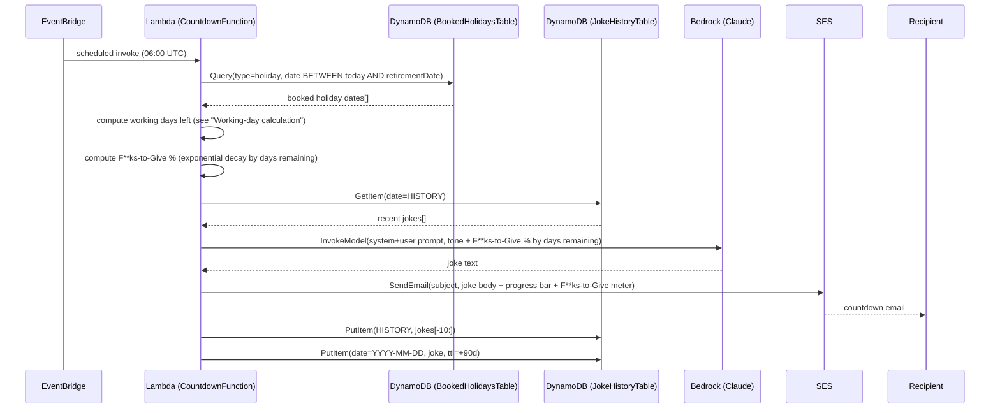
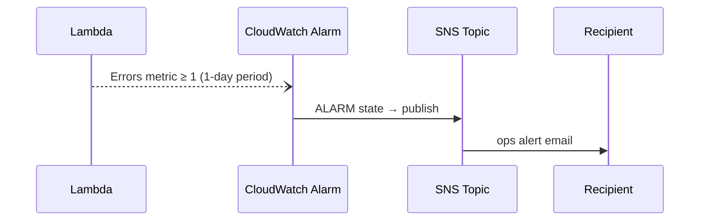

# Architecture

## Overview

`retirement-calleth` is a single-purpose, event-driven serverless application
defined as one AWS CDK stack (`RetirementCountdownStack`). There is no
public-facing endpoint — the only trigger is a scheduled EventBridge rule,
and the only outputs are two emails (the daily joke, and an occasional
ops-error alert).

## Components

| Component | AWS Service | Purpose |
|---|---|---|
| `DailyScheduleRule` | Amazon EventBridge (Scheduler rule) | Cron trigger, `06:00 UTC` daily, invokes the Lambda |
| `CountdownFunction` | AWS Lambda (Node.js 20.x, `NodejsFunction`) | Computes days remaining (net of booked holidays), calls Bedrock, sends email, reads/writes DynamoDB |
| `JokeHistoryTable` | Amazon DynamoDB | Stores recent joke text (rolling list, key `HISTORY`) plus one dated record per day (90-day TTL) |
| `BookedHolidaysTable` | Amazon DynamoDB | Stores individually booked holiday dates, managed via `bin/manage-holidays.ts` (not by the Lambda — see [State](#state) and [IAM](#iam)) |
| Bedrock invocation | Amazon Bedrock Runtime (`InvokeModel`) | Generates the joke text via a Claude foundation model |
| Email delivery | Amazon SES (`SendEmail`) | Sends the daily countdown email to the recipient |
| `FunctionErrorAlarm` | Amazon CloudWatch Alarm | Fires when the Lambda reports ≥1 error in a day |
| `OpsAlertTopic` | Amazon SNS + email subscription | Delivers the CloudWatch alarm notification to the recipient's inbox |

## Request / data flow

Error path (any unhandled exception in the handler):

## Working-day calculation

`lambda/workingDays.ts` computes the number of working days remaining
(inclusive of `RETIREMENT_DATE`, exclusive of today), rather than a plain
calendar-day count. A day counts as non-working if any of the following
apply:

1. **Weekend** — Saturday or Sunday.
2. **England & Wales bank holiday** — New Year's Day, Good Friday, Easter
   Monday, the early-May, Spring, and Summer bank holidays, and Christmas
   Day/Boxing Day. Fixed dates are shifted off a weekend onto the next
   working day using the same substitution rule gov.uk publishes (Christmas
   Day and Boxing Day are shifted as a pair, so they never collide on the
   same substitute day); Easter-based holidays are computed from Easter
   Sunday via the Anonymous Gregorian (Meeus/Jones/Butcher) algorithm, so
   no yearly holiday list needs to be maintained. This does **not** cover
   Scotland/Northern Ireland-specific holidays (e.g. St Andrew's Day, an
   early-rather-than-late-August Summer bank holiday).
3. **Christmas closure** — every day from 25 December through 1 January
   inclusive, regardless of weekday or bank-holiday status (an office
   closure on top of the statutory holidays, e.g. 29–31 December).
4. **Fortnightly non-working Friday** — every other Friday is a
   non-working day, anchored to `NON_WORKING_FRIDAY_ANCHOR` (any one known
   non-working Friday, passed in as `nonWorkingFridayAnchor` context —
   see [Configuration](#configuration)); the pattern alternates every 7
   days from that anchor in both directions.
5. **Booked holiday** — an individually registered date, stored in
   `BookedHolidaysTable` and managed via `bin/manage-holidays.ts` (`add`,
   `range`, `remove`, `remove-range`, `list`). The Lambda queries all
   booked holidays between today and `RETIREMENT_DATE` on every invocation
   (`getBookedHolidays` in `lambda/holidays.ts`) and passes them into
   `workingDaysUntilRetirement` as a `Set<number>` of UTC millisecond
   timestamps, so a booking made via the CLI is reflected in the very next
   scheduled email with no additional propagation step.

The bank-holiday and Easter calculations are pure, dependency-free
functions (no external calendar API), verified against the published
gov.uk bank holiday lists for 2026–2028 in `lambda/workingDays.test.ts`.
One-off bank holidays outside the normal rule set (e.g. a state funeral or
coronation) aren't and can't be predicted algorithmically — they'd need a
manual override if one is ever announced during the countdown.

## Email content

Beyond the working-day count and Bedrock-generated joke, `lambda/email.ts`
computes two derived, presentation-only values from `days` (working days
remaining) and renders both the HTML and plaintext email bodies:

- **Progress bar** (`progressPct`) — linear, calendar-day-based percentage
  of the way from `COUNTDOWN_START_DATE` to `RETIREMENT_DATE`. Cosmetic
  only; does not affect the working-day count.
- **F**ks-to-Give meter** (`fucksToGivePct`) — an exponential *saturation*
  curve, `100 * (1 - e^(-days / 30))`, driven by working days remaining
  (the same `days` value, not calendar days). It sits near 100% while
  retirement is hundreds of days out, then craters through the final
  weeks as `days` shrinks toward zero (≈96% at 100 days, ≈63% at 30,
  ≈21% at 7, ≈3% at 1, 0% on the day). Its current reading is also passed
  into the Bedrock prompt (`generateJoke` in `lambda/handler.ts`) as
  additional tone context alongside the countdown-stage tone from
  `stageForDays`, so the generated joke's attitude can track both.

Both functions are pure (no I/O), unit-tested in `lambda/email.test.ts`,
and require no additional DynamoDB state — the meter's decay constant
(`30`) is a hardcoded tuning value, not configuration.

## Compute and packaging

- `CountdownFunction` uses `aws-cdk-lib/aws-lambda-nodejs`, which bundles
  `lambda/handler.ts` with esbuild at synth/deploy time (no manual build
  step, no committed `dist/`).
- Runtime: Node.js 20.x, 256 MB memory, 30 s timeout — comfortably sized for
  a handler that makes three sequential network calls (DynamoDB read,
  Bedrock invoke, SES send, DynamoDB writes).
- No VPC attachment — the function only talks to AWS service APIs, so it
  runs in the Lambda-managed execution environment with direct access to
  public AWS service endpoints.

## State

`JokeHistoryTable` (DynamoDB, on-demand/`PAY_PER_REQUEST` billing) holds two
item shapes under a single partition key `date`:

- `date = "HISTORY"` — a rolling list of the last 10 joke strings, used as
  negative examples in the Bedrock prompt so jokes don't repeat.
- `date = "YYYY-MM-DD"` — one record per day the function has run
  (`joke`, `ttl`), kept for 90 days via TTL for debugging/audit, then
  automatically deleted.

The table has `RemovalPolicy.DESTROY`, so `cdk destroy` deletes all history
along with the stack — acceptable given the data is low-value and
regenerable.

`BookedHolidaysTable` (DynamoDB, on-demand billing) uses a partition key
`type` and sort key `date`:

- `type = "holiday"`, `date = "YYYY-MM-DD"` — one item per booked date, plus
  an `addedAt` timestamp. The sort key enables the `Query` with
  `date BETWEEN :start AND :end` that `getBookedHolidays` uses to fetch only
  the dates relevant to the current countdown window.

This table also has `RemovalPolicy.DESTROY`. Unlike `JokeHistoryTable`, the
Lambda never writes to it — see [IAM](#iam).

## Configuration

Stack props (`RetirementCountdownStackProps`) are resolved in
`bin/retirement-countdown.ts` at synth time and passed to the Lambda as
plain (unencrypted-beyond-default) environment variables:

- `RETIREMENT_DATE`, `SENDER_EMAIL`, `RECIPIENT_EMAIL`, `BEDROCK_MODEL_ID`,
  `COUNTDOWN_START_DATE`, `NON_WORKING_FRIDAY_ANCHOR`, `TABLE_NAME`,
  `HOLIDAYS_TABLE_NAME`.

`retirementDate`, `senderEmail`, `recipientEmail`, and
`nonWorkingFridayAnchor` are personal data, so they are **not** hardcoded
in source — `bin/retirement-countdown.ts` reads them from CDK context
(`app.node.tryGetContext`) and throws before synth if any is missing,
requiring them to be passed with `-c` on every `synth`/`deploy`/`destroy`
invocation (or supplied via a gitignored `cdk.context.json`).
`countdownStartDate` is also context-supplied but defaults to today's date
if omitted, since it only affects the email's cosmetic progress bar, not
the working-day count. `bedrockModelId` is not personal data and stays
hardcoded as a sensible default.

There is no external config store (SSM/Secrets Manager) — none of these
values are secret, only configuration and low-sensitivity PII (personal
email addresses), and keeping them out of committed source is sufficient.

## IAM

The Lambda's execution role is scoped per-resource by CDK's grant helpers
where possible:

- `jokeHistoryTable.grantReadWriteData(countdownFn)` — read/write limited to
  the one table.
- `holidaysTable.grantReadData(countdownFn)` — **read-only**. The Lambda
  never writes booked holidays; all mutation goes through
  `bin/manage-holidays.ts`, run by a human under their own AWS credentials
  (`AWS_PROFILE`), not the Lambda's execution role. This means a compromised
  or buggy Lambda invocation cannot alter the holiday calendar, only read
  from it — a deliberate asymmetry versus `JokeHistoryTable`.
- `bedrock:InvokeModel` — restricted to the specific model. For a
  cross-region inference profile id (`eu.`/`us.`/`apac.`/`global.` prefix),
  the grant covers both the inference-profile ARN and the underlying
  foundation-model id across all regions the profile can route to, since
  invoking through a profile requires both.
- `ses:SendEmail` / `ses:SendRawEmail` — restricted to the sender and
  recipient identity ARNs (`arn:aws:ses:<region>:<account>:identity/<email>`)
  rather than `"*"`. Both identities are granted because, while the SES
  account is in the sandbox, SES authorizes `SendEmail` against the
  recipient identity as well as the sender — see
  [threat-model.md](threat-model.md) and
  [well-architected-review.md](well-architected-review.md).
- Default CloudWatch Logs permissions are attached automatically by
  `NodejsFunction` for the function's own log group.

## Observability

- Lambda execution logs go to CloudWatch Logs (default log group, no
  custom retention set — see Well-Architected review).
- `FunctionErrorAlarm` watches the Lambda `Errors` metric over a 1-day
  period and treats missing data as "not breaching" (so a day with zero
  invocations doesn't false-positive).
- No tracing (X-Ray), custom metrics, or dashboards — reasonable for a
  single daily invocation with a single consumer.

## Deployment model

Single CDK stack, deployed manually via `npx cdk deploy` from a developer
workstation using local AWS credentials. There is no CI/CD pipeline or
staging environment; `lambda/workingDays.ts` and `lambda/email.ts` have a
Jest unit-test suite (`npm test`), but the CDK stack itself has no
snapshot/assertions tests.
